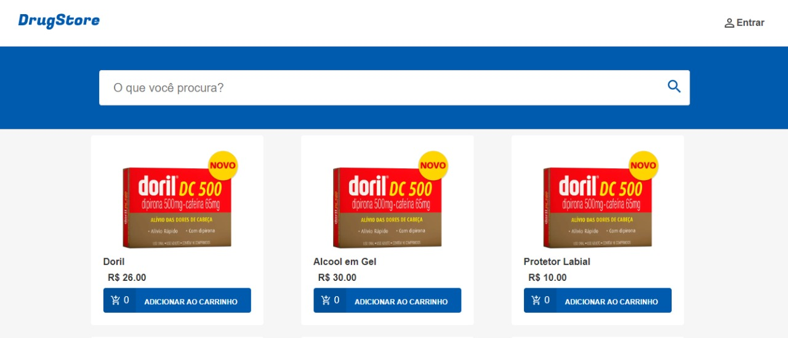
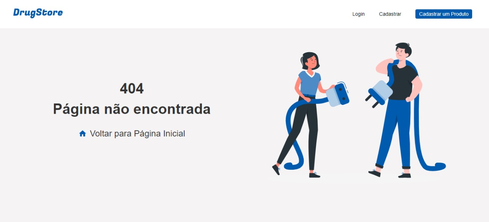

<h1 align="center">
    
</h1>

  <a href="#rocket-tecnologias">Tecnologias</a>&nbsp;&nbsp;&nbsp;|&nbsp;&nbsp;&nbsp;
  <a href="#-projeto">Projeto</a>&nbsp;&nbsp;&nbsp;|&nbsp;&nbsp;&nbsp;
  <a href="#memo-licença">Licença</a>

 

<h1 align="center">
    Telas
</h1>

  
  

## :rocket: Tecnologias

Esse projeto foi desenvolvido com as seguintes tecnologias:

- [AdonisJs](https://adonisjs.com/)
- [React](https://reactjs.org)

## 💻 Projeto

A DrugStore é um projeto de loja virtual usando varias tecnologias mais recentes no mercado.

## :memo: Licença

Esse projeto está sob a licença MIT. Veja o arquivo [LICENSE](LICENSE.md) para mais detalhes.